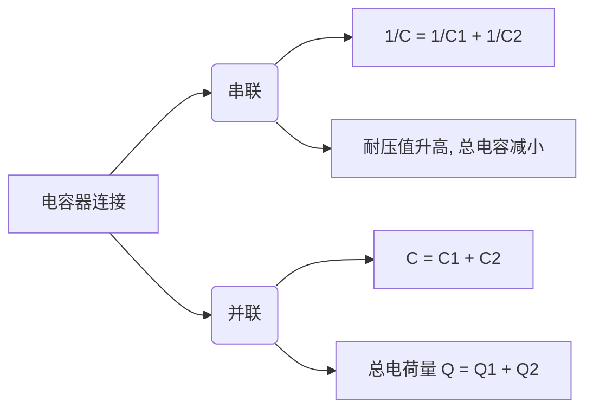

# 1. 导体的静电平衡条件

**定义：** 导体内部和表面都没有电荷定向移动的状态。

- **基本条件：** 导体内部任意一点的场强为零，即 $\vec{E}_{内} = 0$。
- **表面条件：** 导体表面附近的场强 $\vec{E}_{表}$ 与该处表面垂直。

### 2. 导体在静电平衡状态时的性质

1. **电荷分布：** 电荷只能分布在导体的外表面上，导体内部净电荷为零。
2. **等势体：** 整个导体是一个等势体，导体表面是一个等势面。
3. **表面场强：** 导体表面某点附近的场强大小与该处表面的电荷面密度 $\sigma$ 成正比：$E = \frac{\sigma}{\varepsilon_0}$
4. **尖端放电：** 在孤立导体表面，曲率半径越小的地方（越尖锐的地方），电荷面密度 $\sigma$ 越大，场强越强。

### 3. 静电屏蔽 
(Electrostatic Shielding)

- **空腔导体（不带电）：** 空腔内无电场，外电场不影响腔内。
- **接地空腔导体：** 腔内电荷产生的电场不影响腔外，实现内外双向屏蔽。

### 4. 孤立导体的电容

**定义：** 使孤立导体升高单位电势所需的电荷量。

- **公式：** $C = \frac{Q}{V}$
- **单位：** 法拉 (F)

### 5. 电容器的电容 
(Capacitance)

电容器是由两个彼此绝缘且靠得很近的导体构成的系统。公式统称为 $C = \frac{Q}{U}$（$U$ 为两极板间电势差）。

|**电容器类型**|**电容公式 C**|**关键参数说明**|
|---|---|---|
|**导体球**|$4\pi\varepsilon_0 R$|$R$: 球半径|
|**球形电容器**|$4\pi\varepsilon_0 \frac{R_1 R_2}{R_2 - R_1}$|$R_1, R_2$: 内外球壳半径|
|**平行板电容器**|$\frac{\varepsilon_0 S}{d}$|$S$: 极板面积, $d$: 板间距|
|**圆柱形电容器**|$\frac{2\pi\varepsilon_0 L}{\ln(R_2/R_1)}$|$L$: 长度, $R_1, R_2$: 内外半径|

### 6. 电容器的连接

### 7. 电介质的极化

**现象：** 电介质放入电场后，其表面（或内部）出现束缚电荷的现象。

- **相对介电常数 $\varepsilon_r$：** 充满电介质后，电容变为原来的 $\varepsilon_r$ 倍 ($C = \varepsilon_r C_0$)，极板间场强减弱为原来的 $1/\varepsilon_r$。
    

### 8. 电位移矢量与高斯定理

为了处理电介质中的电场，引入辅助矢量 $\vec{D}$。

- **关系式：** $\vec{D} = \varepsilon_0 \varepsilon_r \vec{E} = \varepsilon \vec{E}$
- **有介质时的高斯定理：**
    $$\oint_S \vec{D} \cdot \text{d}\vec{S} = \sum q_{自由}$$
    
    _(注意：该定理只与闭合面内的**自由电荷**有关，不计入束缚电荷)_

### 9. 电场的能量

电场不仅是力的传递者，也是能量的载体。

- **电容器储能：** $W_e = \frac{1}{2}CU^2 = \frac{Q^2}{2C}$
    
- **电场能量密度 $w_e$：** 单位体积内的能量。
    
    $$w_e = \frac{1}{2}\varepsilon E^2 = \frac{1}{2}DE$$
    
- **总能量：** $W = \int w_e \text{d}V$
    
