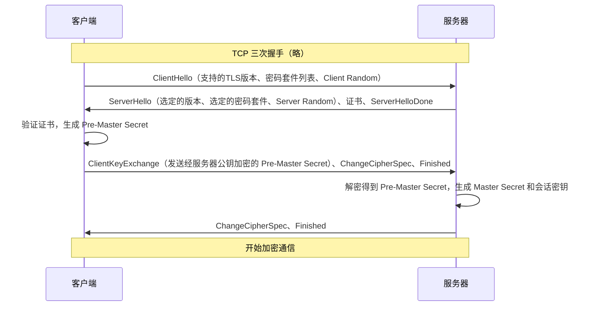
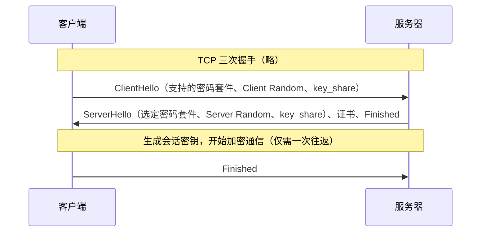

---
aliases:
  - Secure Sockets Layer
  - 安全套接层
  - Transport Layer Security
  - 传输层安全协议
tags:
  - CTF
date: 2026-05-27
---
# 1. 版本演进：从商业产物到开放标准

理解这一点，是看懂后续所有差异的基础。

*   **核心差异**：**SSL** 是网景公司 (**Netscape**) 开发的商业产品；**TLS** 则是国际互联网工程任务组 (**IETF**) 在SSL 3.0基础上制定的**开放标准**。在计算机科学里，从“某公司的产品”到“社区的开放标准”，意味着更广泛的审查和安全性保障。

*   **版本对应关系**
    *   **SSL 1.0** → 因严重缺陷从未公开发布。
    *   **SSL 2.0 (1995)** → 首个公开发布，但有严重漏洞。
    *   **SSL 3.0 (1996)** → 一次重要重写，大规模应用，但后来发现POODLE漏洞。
    *   **TLS 1.0 (1999)** → 相当于 **SSL 3.1**，与SSL 3.0差异很小，主要是标准化和规范化。
    *   **TLS 1.1 (2006)** → 主要是安全加固。
    *   **TLS 1.2 (2008)** → **主流经典版本**，引入HMAC-SHA256等更安全的算法。
    *   **TLS 1.3 (2018)** → **颠覆性革新**，大幅简化握手，彻底移除老旧算法。

> **一个重要事实**：所有SSL版本和TLS 1.0/1.1因严重安全漏洞，如今已被主流浏览器全面禁用。在真实世界，你现在只会遇到 **TLS 1.2** 和 **TLS 1.3**。

# 2. 协议框架：高度相似但实现迥异

SSL和TLS都采用两层结构：底层是**记录协议 (Record Protocol)**，上层是其子协议（握手协议、警报协议等）。

#### ➕ 底层：记录协议 (Record Protocol)

*   **版本号**：TLS 1.0的`{major, minor}`版本号是`{3, 1}`。几乎所有TLS版本都使用`3.x`，以保证兼容性。下表是各协议对应的实际版本号：

| 协议 | 主版本 (major) | 次版本 (minor) |
| :--- | :--- | :--- |
| SSL 3.0 | 3 | 0 |
| TLS 1.0 | 3 | 1 |
| TLS 1.1 | 3 | 2 |
| TLS 1.2 | 3 | 3 |
| TLS 1.3 | 3 | 4 |

*   **填充机制 (Padding)**：SSL 3.0的填充机制存在设计缺陷，直接导致了2014年曝光的**POODLE攻击**，攻击者可逐字节解密加密数据。TLS通过更严格的规定修复了此漏洞，攻击者无法实施同样的攻击。

#### 🤝 上层：核心子协议差异

SSL/TLS 握手协议、Change Cipher Spec 协议和警报协议构成了协议的上层。

*   **Change Cipher Spec 协议**：在 TLS 1.3 中被移除，因为其功能被整合进了握手消息中，使协议更简洁。

*   **警报协议 (Alert Protocol)**：用于在通信出错时双向传递错误信息，分为警告和致命错误两类。
    *   **SSL** 对错误分类和定义较模糊。
    *   **TLS** 规范更清晰，增加了更多警报类型，使问题诊断更精确。

# 核心流程对比：握手过程的巨大变革

这是SSL/TLS协议中最重要的部分，也是理解安全通信如何建立的关键。

#### 🔩 TLS 1.2及之前：经典的两次往返 (2-RTT) 握手

下面这张时序图展示了浏览器访问一个全新网站时的完整握手过程：

1.  **第一步 (ClientHello)**：客户端发出连接请求，包含自己支持的TLS版本、一个随机数（Client Random）和密码套件列表。
2.  **第二步 (ServerHello)**：服务器响应，选出协议版本、一个密码套件，并生成自己的随机数（Server Random）。同时发送数字证书。
3.  **密钥交换**：客户端验证证书后，生成一个“预备主密钥 (Pre-Master Secret)”，用服务器证书中的公钥加密后发送。
4.  **密钥生成**：双方使用“Client Random”、“Server Random”和“Pre-Master Secret”计算出相同的“主密钥 (Master Secret)”，再由主密钥派生出用于加密、完整性校验等最终会话密钥。
5.  **切换加密**：双方依次发送 ChangeCipherSpec 消息，告知对方后续通信将启用刚刚协商好的加密。

> **注意**：整个过程耗时两次网络往返（2-RTT，Round-Trip Time），首次连接时性能开销较大。

#### 🚀 TLS 1.3的革命：一次往返 (1-RTT) 握手

TLS 1.3 为了实现“安全+性能”的双重提升，对握手流程进行了大刀阔斧的改革：

1.  **提前预测 (Key Share)**：客户端在第一条消息里，除自身随机数和密码套件列表外，还会猜一个最常用的密钥交换参数并直接发过去。如果服务器支持，它就能在回复时直接发回自己的那部分参数。双方无需额外交互，就能直接计算出会话密钥。这相当于减少了 **一次完整的网络往返时间 (1-RTT)**，性能提升巨大。
2.  **握手结束即加密**：服务器发送完 Finished 消息后，即可立即发送加密的应用数据，密文也得到保护。
3.  **精简密码套件**：移除了RSA密钥交换和所有CBC模式等易出问题的算法。
4.  **简化协议**：移除了 ChangeCipherSpec 和很多过时扩展。
5.  **默认前向安全 (Forward Secrecy)**：确保即使服务器的长期私钥泄露，过去的会话也无法被解密，通信历史记录是安全的。

# 4. 加密算法与密码套件：强度与集成的差异

*   **密码套件 (Cipher Suite)**：简单说，它是一组用于“密钥交换+身份验证+加密+完整性校验”的算法组合。

*   **主要差异**：下表清晰对比了SSL 3.0、TLS 1.2 和 TLS 1.3 在核心组件上的选择：

| 协议组件      | SSL 3.0 / TLS 1.0 / 1.1 (已废弃) | TLS 1.2             | TLS 1.3               |
| :-------- | :---------------------------- | :------------------ | :-------------------- |
| **密钥交换**  | RSA为主，缺乏前向安全                  | RSA、ECDHE、DHE       | **仅支持 (EC)DHE**       |
| **身份验证**  | RSA、DSA                       | RSA、DSA、ECDSA       | **仅支持 RSA 和 ECDSA**   |
| **对称加密**  | IDEA、DES、3DES等（已过时）           | AES、ChaCha20（主流）    | **仅支持 AEAD**          |
| **哈希算法**  | MD5、SHA-1（已不安全）               | SHA-2 系列（如 SHA-256） | **仅支持 SHA-2 系列**（更严格） |
| **完整性校验** | MAC（如 HMAC-MD5）               | HMAC-SHA-256 等      | **集成在 AEAD 算法内**      |

*   **关键安全增强详解**
    *   **AEAD (Authenticated Encryption with Associated Data)**：TLS 1.3在加密时同时完成完整性校验，既避免组合错误，也提升了速度。
    *   **前向保密 (Forward Secrecy)**：TLS 1.3将其设为强制要求。即使服务器私钥未来泄露，过去记录的历史会话也无法被解密，极大提升了长期通信的安全性。

### 💎 总结：一张表看透本质

| 维度 | SSL (2.0, 3.0) | TLS (1.0, 1.1, 1.2, 1.3) |
| :--- | :--- | :--- |
| **本质** | 商业产品，Netscape主导 | **开放标准**，由IETF维护 |
| **当前状态** | 已全部废弃，**不安全** | **现代互联网事实标准** |
| **握手耗时** | 2-RTT | TLS 1.2: 2-RTT，TLS 1.3: 1-RTT |
| **记录格式** | 基本相同，但版本号不同 | **相同**，但TLS使用 `3.x` 版本号 |
| **密码套件** | 老旧、不安全 | 移除不安全算法，TLS 1.3 仅支持AEAD |
| **安全性** | 存在严重漏洞（如POODLE） | **安全**，TLS 1.3 强制前向保密 |