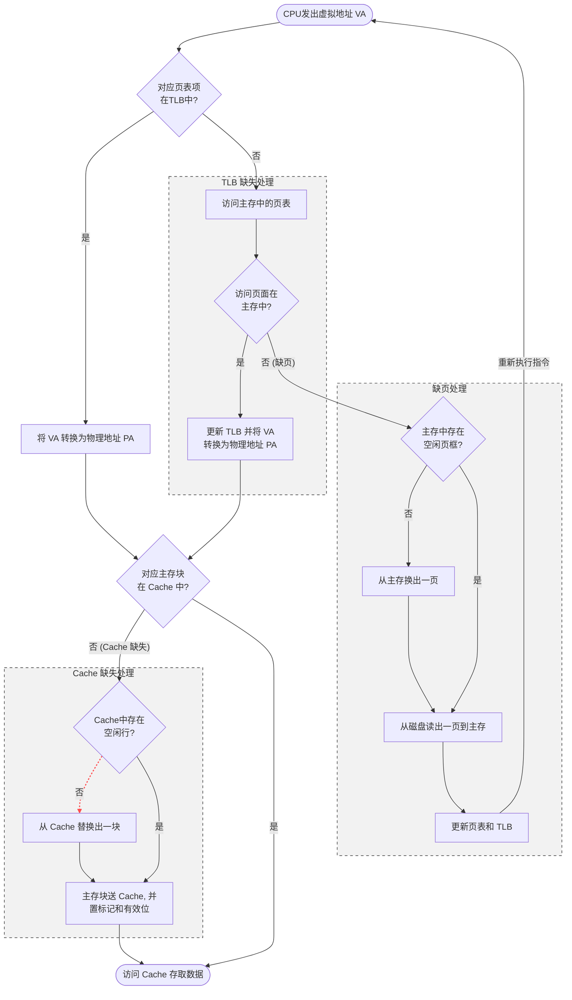

---
aliases:
  - 地址变换
  - TLB
tags:
  - 计算机组成原理
  - 操作系统
date: 2026-03-31
---
[[相联存储器]]: 

| **TLB** | **页表 (PT)** | **Cache** | **说明**                                           |
| ------- | ----------- | --------- | ------------------------------------------------ |
| ✅       | -           | ✅         | **最快路径**。TLB 找到地址，Cache 找到数据。                    |
| ✅       | -           | ❌         | 地址转换极快，但数据需从**主存**读取。                            |
| ❌       | ✅           | ✅         | TLB 没中，查页表后发现页面在内存，随后 Cache 命中数据。                |
| ❌       | ✅           | ❌         | 典型流程：TLB 没中 $\to$ 查页表中 $\to$ Cache 没中 $\to$ 访主存。 |
| ❌       | ❌           | -         | **最慢路径**。发生**缺页异常**，需要进行磁盘 I/O。                  |
TLB命中, 页表一定也命中 ; 页表缺失, Cache一定也缺失

-

---

# 缺页中断异常页异常的处理
1. **操作系统（OS）出手**：在缺页异常处理程序中，OS 把页面从磁盘搬到内存，并更新了**页表（Page Table）📋**，标记该页现在“在内存中”。
    
2. **指令重执行**：异常处理结束后，CPU 会重新执行刚才那条导致缺页的指令。它再次发出同一个**虚拟地址（VA）**。
    
3. **再次访问 TLB**：
    
    - 此时 TLB 🗺️ 里面还是没有这个地址。
    - 但因为页表 📋 已经更新了，CPU 在查找页表时会**命中**。
        
4. **回填 TLB**：一旦从页表获取了物理地址，硬件（或 OS，取决于架构）就会自动把这个全新的映射关系**写入 TLB**。
    
    
5. **Cache 的特性**：Cache 只会自动缓存 CPU 最近访问过的数据。在“指令重执行”之前，CPU 还没来得及真正“读”到这个新搬来的物理地址，所以 Cache 里自然没有它的备份。

- **第一次尝试**：TLB ❌ $\to$ 页表 ❌ $\to$ **触发缺页异常**（去磁盘搬家）。
- **第二次尝试（指令重执行）**：TLB ❌ $\to$ 页表 ✅（从内存取地址并**更新 TLB**） $\to$ Cache ❌ $\to$ **从主存取数据**（并更新 Cache）。
- **第三次访问（如果再读同一个数据）**：TLB ✅ $\to$ Cache ✅。**这时候才是真正的全速运行！** 🚀

---

