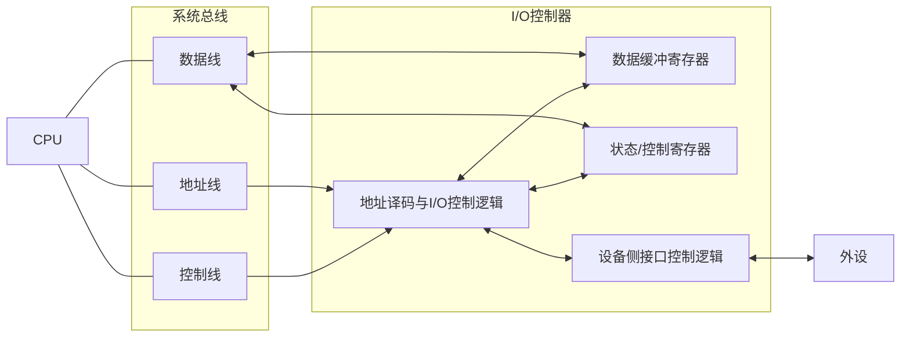

---
aliases:
  - IO接口
  - 设备控制器
  - 统一编址
  - IO控制器
tags:
  - 计算机组成原理
date: 2026-05-16
---
# IO 接口的功能

1. 通过地址译码帮助 CPU 进行设备选择, 以及主机和外设之间的通信联络控制
2. 实现数据缓冲
3. 信号格式转换
4. 传送控制命令和状态信息

# IO 接口的基本结构

数据线: 读写数据、状态信息、控制信息、中断类型

地址线: CPU 要访问的 IO 寄存器地址
控制线: 读写控制型号、中断请求、响应信号、仲裁信号、握手信号

1. 主机发命令字到 IO 控制寄存器, 向设备发送命令 (需要驱动程序的协助)
2. 主机从状态寄存器中读取状态字, 获取外设和IO控制器的状态信息
3. 从数据寄存器中读写数据, 完成主机和外设的数据交换

IO 接口(interface) 中的寄存器常被称为 IO 端口(port)
- 接口是包含多种逻辑电路的硬件芯片或板卡，
- 端口特指接口内部可以被CPU直接进行读写访问的寄存器（如数据端口、状态端口、控制端口）。

# IO 端口

IO 指令实现对端口的访问操作, 是一种特权指令
- 数据端口中的数据可读可写
- 状态端口中的外设状态只读
- 控制端口中的各种控制命令只写

- **独立编址**：I/O 端口和主存**分别编址**，使用专门的 I/O 指令访问。
- **统一编址**：把 I/O 端口当作内存单元的一部分，和主存**统一编址**，用普通访存指令访问。

| 对比项目    | 独立编址                    | 统一编址                      |
| ------- | ----------------------- | ------------------------- |
| 编址方式    | I/O端口地址与主存地址分开          | I/O端口地址与主存地址统一在同一地址空间     |
| 访问指令    | 需要专门的I/O指令，如 `IN`、`OUT` | 使用普通访存指令，如 `LOAD`、`STORE` |
| 主存地址空间  | 不占用                     | 占用一部分主存地址空间               |
| 指令系统复杂度 | 较高，需要专门设计I/O指令          | 较低，不必单独设置指令               |
| 编程方便性   | 较差，内存操作和I/O操作分开         | 较好，可把设备寄存器当作内存单元访问        |
| 操作灵活性   | 较差，很多普通内存操作不能直接用于I/O    | 较强，很多对内存的操作方式可用于I/O       |
| 硬件区分    | 内存和I/O在控制上区分明显          | 需要通过地址译码区分某地址是内存还是I/O     |
| 地址空间利用  | 内存地址空间利用更充分             | 内存可用地址空间减少                |
[[IO方式]]: 即控制方式, 实现主机与外设之间的数据传输