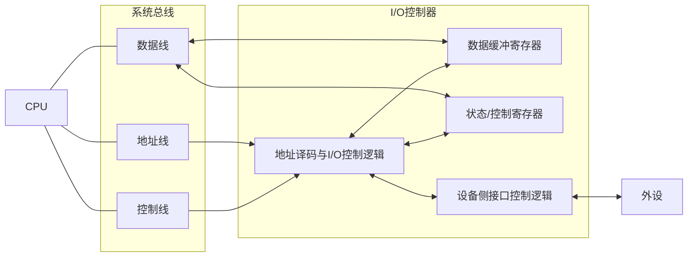

---
aliases:
  - IO接口
  - 设备控制器
  - 统一编址
  - IO控制器
tags:
  - 计算机组成原理
date: 2026-05-16
---
CPU 一般情况下只有在[[内核态]]会与外设(I/O接口)进行交互, 在[[中断的处理|系统调用]]用的过程中, 一定会发生[[中断的处理]]
# IO 接口的功能

1. 通过地址译码帮助 CPU 进行设备选择, 以及主机和外设之间的通信联络控制
2. 实现数据缓冲
3. 信号格式转换
4. 传送控制命令和状态信息

# IO 接口的基本结构

数据线: 读写数据、状态信息、控制信息、中断类型

地址线: CPU 要访问的 IO 寄存器地址
控制线: 读写控制型号、中断请求、响应信号、仲裁信号、握手信号

1. 主机发命令字到 IO 控制寄存器, 向设备发送命令 (需要驱动程序的协助)
2. 主机从状态寄存器中读取状态字, 获取外设和IO控制器的状态信息
3. 从数据寄存器中读写数据, 完成主机和外设的数据交换

IO 接口(interface) 中的寄存器常被称为 IO 端口(port)
- 接口是包含多种逻辑电路的硬件芯片或板卡，
- 端口特指接口内部可以被CPU直接进行读写访问的寄存器（如数据端口、状态端口、控制端口）。

# IO 端口

IO 指令实现对端口的访问操作, 是一种特权指令
- 数据端口中的数据可读可写
- 状态端口中的外设状态只读
- 控制端口中的各种控制命令只写

- **独立编址**：I/O 端口和主存**分别编址**，使用专门的 I/O 指令访问。
- **统一编址**：把 I/O 端口当作内存单元的一部分，和主存**统一编址**，用普通访存指令访问。

| 对比项目    | 独立编址                    | 统一编址                      |
| ------- | ----------------------- | ------------------------- |
| 编址方式    | I/O端口地址与主存地址分开          | I/O端口地址与主存地址统一在同一地址空间     |
| 访问指令    | 需要专门的I/O指令，如 `IN`、`OUT` | 使用普通访存指令，如 `LOAD`、`STORE` |
| 主存地址空间  | 不占用                     | 占用一部分主存地址空间               |
| 指令系统复杂度 | 较高，需要专门设计I/O指令          | 较低，不必单独设置指令               |
| 编程方便性   | 较差，内存操作和I/O操作分开         | 较好，可把设备寄存器当作内存单元访问        |
| 操作灵活性   | 较差，很多普通内存操作不能直接用于I/O    | 较强，很多对内存的操作方式可用于I/O       |
| 硬件区分    | 内存和I/O在控制上区分明显          | 需要通过地址译码区分某地址是内存还是I/O     |
| 地址空间利用  | 内存地址空间利用更充分             | 内存可用地址空间减少                |
[[IO方式]]: 即控制方式, 实现主机与外设之间的数据传输

---

# 完整流程：从 `printf` 到字符被外设打印

#### 1. 用户态调用
- C 代码中调用 `printf(str)`，等价于库函数 `write(STDOUT_FILENO, msg, len)`。
- 用户程序将三个参数（文件描述符、缓冲区地址、长度）按调用约定存入寄存器（例如 `ebx, ecx, edx`）。

#### 2. 准备系统调用
- 根据函数名 `write` 得到系统调用号（假设 `__NR_write = 4`）。
- 将系统调用号 `4` 加载到 `eax` 寄存器（`mov $4, %eax`）。

#### 3. 触发软中断
- 库函数 `_syscall3` 执行 `int $0x80`，触发 0x80 软中断。
- 这条软中断的门描述符已在开机时通过 `set_system_gate(0x80, &system_call)` 注册好。

#### 4. 硬件自动行为（CPU 切换特权级）
- CPU 从用户态（ring3）切换到内核态（ring0）。
- 自动压栈用户态的 `ss, esp, eflags, cs, eip`，然后跳转到内核入口 `system_call`。

#### 5. 保存现场（形成 pt_regs）
- `system_call` 汇编入口先将剩余的通用寄存器（`eax, ebx, ecx, edx, esi, edi, ebp` 等）压入内核栈。
- 内核栈上的这组寄存器内容，恰好构成 `struct pt_regs` 结构，用于保存中断发生时的用户态上下文。

#### 6. 查找并执行系统调用函数
- `system_call` 使用 `eax` 中的调用号作为索引，在系统调用表 `sys_call_table` 中查找。
- `call *sys_call_table(, %eax, 4)` → 调用 `sys_write()`。

#### 7. 内核实现写操作（`sys_write`）
- `sys_write` 将数据从用户空间拷贝到内核缓冲区，并根据文件类型执行不同的代码路径。
- 对标准输出（终端/控制台），最终会调用控制台驱动中的输出函数。

#### 8. 驱动操作外设输出字符（循环输出）

对于每一个要输出的字符，驱动会执行类似下面的硬件操作（以你给出的端口为例）：

1. **轮询状态**：不断读取外设控制寄存器 `0x7824`，检查“忙碌”标志。
2. **等待空闲**：若外设正忙，则 CPU 可能会自旋等待（或者在阻塞模式下会调度其他进程，此时之前保存的 pt_regs 就用于将来恢复）。
3. **写入数据**：外设空闲后，将字符写入数据寄存器 `0x7821`（`out %al, $0x7821`）。
4. **发送命令**：向指令寄存器 `0x7820` 发出打印命令。
5. 外设收到命令后，从数据寄存器取出字符，执行打印。

#### 9. 系统调用返回

- `sys_write` 执行完毕，将实际写入的字节数作为返回值存入 `pt_regs` 的 `eax` 字段。
- `system_call` 接着执行返回流程，可能调用调度器（如需要），然后恢复现场：将内核栈中 `pt_regs`的各个值弹出到对应寄存器。
- 最后通过 `iret` 指令，CPU 自动恢复用户态的 `ss, esp, eflags, cs, eip`，回到用户态继续执行。

#### 10. 用户态继续
- `write` 调用返回写入的字节数，`printf` 继续格式化输出或执行后续代码。

