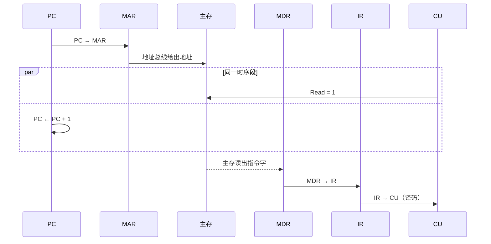
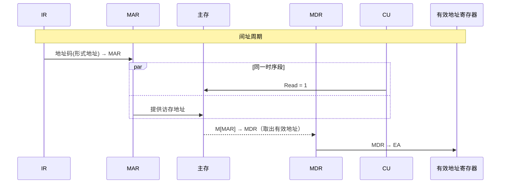
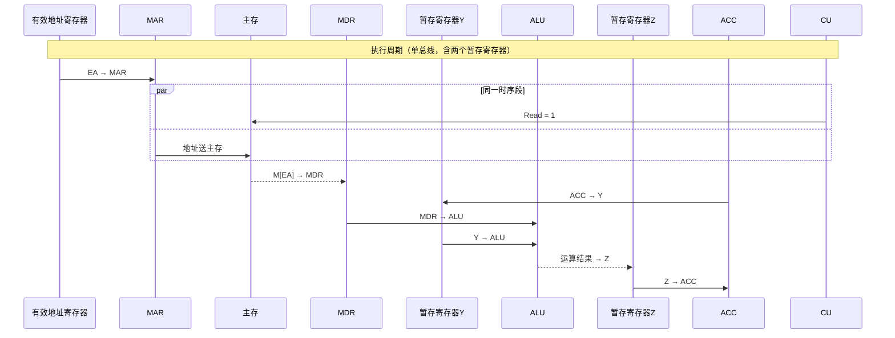

---
aliases:
  - 指令执行过程
  - 周期
tags:
  - 计算机组成原理
date: 2026-03-30
---
# 指令周期

## 1.1 指令周期

- 指令周期 = 取址周期 + (间址周期) + 执行周期 + 中断周期
- 只有在指令结束后检测到[[中断处理]], 并且CPU决定响应是, 才进入中断周期
## 1.2 机器周期

- 可以把机器周期看作以一次访存为中心的工作周期, 以访存操作为核心, 但不只是纯粹的访存时间
- 如果指令字长 = 2 * 存储字长, 一次取指周期可以认为需要两个机器周期
- [[字长|指令字长、存储字长、指令字长三者无固定相等关系，但不是互不相关]]
## 1.3 时钟周期

# 指令周期数据流
FE：Fetch（取指周期）  
IND：Indirect（间址周期）  
EX：Execute（执行周期）  
INT：Interrupt（中断周期）

## 2.1 取指周期
- CPU 从内存中读取下一条即将执行的指令, 并为下一条指令准备好地址 (更新 PC )

## 2.2 间指周期
- 当遇到间接寻址的指令时, CPU 需要再次访存, 把指令中的形势地址转换为操作数的真正有效地址

## 2.3 执行周期
- CPU 根据取出的指令, 指挥相关硬件完成具体的数据运算或控制操作
- 不同指令中, 只有执行周期内会有比较大的区别

## 2.4 中断周期
- 只有在指令结束后检测到中断, 并且CPU决定响应是, 才进入中断周期, 执行[[中断处理]]
- CPU 暂停当前正在执行的程序, 把当前的运行状态(断电)保存起来, 去处理突发的外部或内部请求.
## 2.5 空操作数据
- CPU 不执行任何实质性的工作, 仅消耗时间, 主要用于程序样式、指令对齐或等待其他慢速设备(解决流水线冲突)
- NOP 会完成正常的取指和顺序控制流程，取址操作结束后 PC 自动 + 1
- 但不会对通用寄存器、数据存储器、标志寄存器等体系结构可见状态产生有意义的修改。
# 指令执行方案
## 3.1 单周期

- 每条指令在一个时钟周期内完成, 指令之间串行执行, 指令周期全部统一为执行时间最长的指令
- 单周期CPU中, 微操作不是按照时钟周期分不执行的, 而是在一个时钟周期内通过组合逻辑连续完成
- 单周期一般采用专用数据通路模式, 总线的概念与之相悖
- 每条指令只有一个时钟周期, 而在一个时钟周期内控制信号并不会变化, 每个部件只能使用一次

## 3.2 多周期

## 3.3 流水线
- 取指、译码、执行、访存、写回
	从功能阶段角度对指令执行过程的分解

DMA 传送方式中的 [[DMA|周期窃取]],  窃取的是主存的存取周期