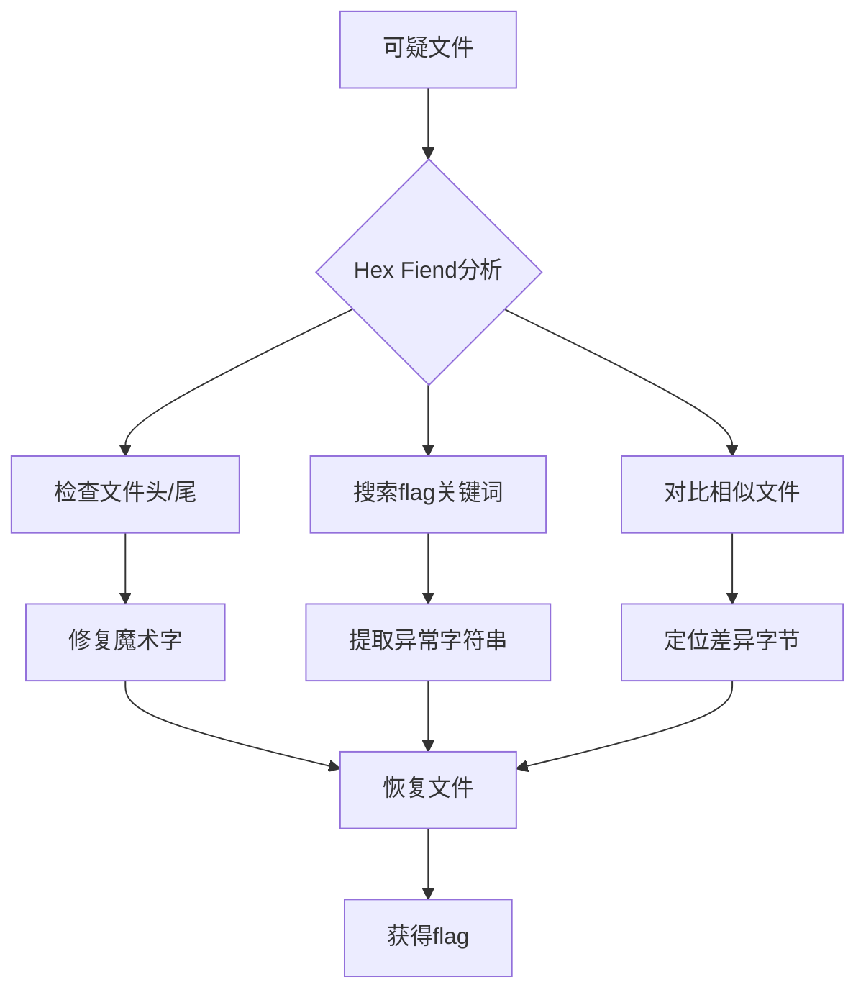

---
aliases:
tags:
  - CTF
gloss: 分析文件隐写的工具
---

在CTF比赛中，Hex Fiend 是分析文件隐写的利器，尤其擅长处理以下五类场景：

---

### 🔍 一、文件头/尾修复（魔术字修复）
**场景**：文件头被破坏（如 `file` 命令显示 "data" 或无法打开）  
**操作技巧**：  
1. **定位偏移量**：  
   - 用 `⌘ + G` 跳转到 `0x0`（文件起始）  
   - 修复常见魔术头：  
     - **JPEG**: `FF D8 FF E0` → 手动输入到前4字节  
     - **PNG**: `89 50 4E 47 0D 0A 1A 0A` → 覆盖前8字节  
     - **ZIP**: `50 4B 03 04`  
2. **文件尾修复**：  
   - `⌘ + ↓` 跳转到结尾，补充结束符：  
     - JPEG: `FF D9`  
     - ZIP: 检查末尾是否存在 `50 4B 05 06` (中央目录结束标记)

> 💡 **案例**：修复被删除PNG头后，文件恢复为可识别图片并隐藏flag

---

### 🔎 二、隐藏数据提取
**场景**：数据被追加到文件末尾、插入缝隙或覆盖闲置区  
**操作技巧**：  
1. **搜索flag特征**：  
   - `⌘ + F` 搜索字符串 `flag{`、`CTF{` 或 `key:`（注意切换文本编码为UTF-8/ASCII）  
   - 十六进制搜索常见关键字：`66 6C 61 67` (即"flag")  
2. **定位异常区域**：  
   - 观察文本区右侧，寻找突然出现的可读字符串（如 `s3cr3t_k3y`）  
   - 检查大段连续 `00` 或 `FF` 区域，中间可能穿插有效数据  
3. **提取隐藏文件**：  
   - 发现新文件头（如 `PK` 即ZIP） → 选中从魔术字到结尾的数据 → 复制十六进制值 → 新建窗口粘贴并保存为新文件

---

### ⚖ 三、文件对比（Diff模式）
**场景**：两个相似文件存在细微差异（如LSB隐写）  
**操作流程**：  
1. `File → Open Alternate` 载入对比文件  
2. `View → Diff → Side by Side` 开启并排视图  
3. 焦点停留在差异字节（红色高亮）：  
   - 按 `Tab` 在差异点间跳转  
   - 状态栏显示具体偏移地址（如 `0x3A7C`）  
4. 分析差异处是否构成flag（如差异字节转ASCII后拼出单词）

---

### 📐 四、结构化数据解析
**场景**：分析二进制协议、磁盘映像、内存dump  
**关键操作**：  
1. **数据解释器**（`⌘ + I`）：  
   - 选中4字节 → 查看整数/浮点数值（切换Endianness）  
   - 选中8字节 → 解析为时间戳（UNIX timestamp）  
2. **跳转地址**：  
   - 在ELF文件中用 `⌘ + G` 跳转到 `0x18` 查看 `e_entry`（程序入口点）  
3. **校验和验证**：  
   - 选中数据块 → `Tools → Checksum` → 计算CRC32与文件中的校验值对比

---

### 🧩 五、隐写术专项技巧
#### ▫ 文本隐写
- **编码切换陷阱**：在状态栏切换文本编码（如UTF-16），可能发现隐藏字符串  
- **零宽度字符**：搜索十六进制序列 `EF BB BF` (UTF-8 BOM) 或 `FE FF` (UTF-16 BE)

#### ▫ 图片隐写
1. **IHDR篡改**：  
   - PNG文件中跳转到 `0x10`（宽/高数据区）  
   - 修改高度值（如 `00 00 02 00` → `00 00 04 00`）显示隐藏区域  
2. **IDAT冗余**：  
   - 搜索多个连续的 `49 44 41 54` (IDAT块)，可能包含额外数据

#### ▫ 音频隐写
- WAV文件中定位 `data` 块（`64 61 74 61`）后，观察尾部追加的Base64或异或数据

---

### ⚠ 六、CTF实战注意事项
1. **只读模式优先**：  
   状态栏显示 `Read Only` 可防止误改文件（编辑前务必备份）  
2. **偏移量进制切换**：  
   在 `⌘ + G` 跳转框中，十六进制用 `0x` 前缀（如 `0x7EF`），十进制直接输入数字  
3. **脚本配合**：  
   提取大段数据 → 保存为 `.bin` → 用 `xxd -p data.bin | tr -d '\n'` 转换为连续十六进制字符串  
4. **模板解析**：  
   对PE/ELF文件，加载预定义模板（需下载 `.hfsp`）可视化解析结构体

---

### 🛠 典型CTF解题流

> 案例：某CTF赛题中，在GIF文件尾部发现附加的ZIP文件（PK头），提取后解压获得flag.txt。全程耗时仅1分钟。

掌握这些技巧可快速解决80%的文件隐写题，重点训练**偏移量跳转**、**差异对比**和**数据解释器**的灵活运用！