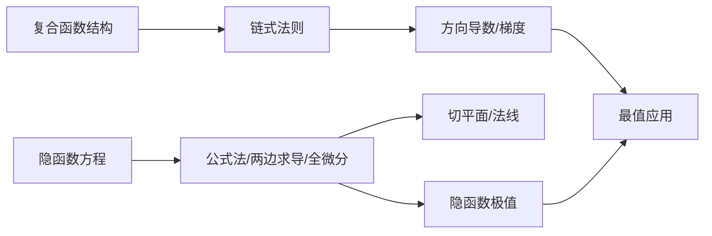

---
aliases:
tags:
  - Math
date: 2026-08-25
---
# 多元函数微分学计算核心 (考研数学补充)
## 1. 基础铺垫：可微、全微分与偏导关系

在深入求导法则前，必须明确 **可微** 是函数局部线性化的核心条件。

若函数 $z = f(x, y)$ 在点 $(x_0, y_0)$ 处可微，则全增量满足：
$$ \Delta z = A \Delta x + B \Delta y + o(\rho) $$
其中 $\rho = \sqrt{(\Delta x)^2 + (\Delta y)^2}$，且 $A = f_x(x_0, y_0)$，$B = f_y(x_0, y_0)$。

**全微分公式**：
$$ dz = \frac{\partial z}{\partial x} dx + \frac{\partial z}{\partial y} dy $$

> **考研常考结论**：可微 $\Rightarrow$ 连续；可微 $\Rightarrow$ 偏导存在；但偏导存在 $\nRightarrow$ 可微（需验证 $\lim \frac{\Delta z - dz}{\rho} = 0$）。若偏导数连续，则函数必可微（充分非必要条件）。

---

## 2. 多元复合函数链式求导法则（Chain Rule）

链式法则的核心在于 **画出变量依赖树状图**。根据中间变量是自变量的函数还是最终变量，分为全导数与偏导数。

### 2.1 一元中间变量（全导数）
设 $z = f(u, v)$，且 $u = \phi(t), v = \psi(t)$，则：
$$ \frac{dz}{dt} = \frac{\partial f}{\partial u} \frac{du}{dt} + \frac{\partial f}{\partial v} \frac{dv}{dt} $$

### 2.2 多元中间变量（偏导数）
设 $z = f(u, v)$，且 $u = \phi(x, y), v = \psi(x, y)$，则：
$$ \frac{\partial z}{\partial x} = \frac{\partial f}{\partial u} \frac{\partial u}{\partial x} + \frac{\partial f}{\partial v} \frac{\partial v}{\partial x} $$
$$ \frac{\partial z}{\partial y} = \frac{\partial f}{\partial u} \frac{\partial u}{\partial y} + \frac{\partial f}{\partial v} \frac{\partial v}{\partial y} $$

### 2.3 向量形式（雅可比矩阵）
对于 $m$ 个中间变量和 $n$ 个自变量，导数矩阵为雅可比矩阵的乘积：
$$ D(f \circ \varphi) = Df(\varphi) \cdot D\varphi $$

### 2.4 一阶全微分形式不变性（延伸）
无论 $u, v$ 是自变量还是中间变量，微分形式 $df = f_u du + f_v dv$ 永远成立。这也是后面隐函数求导的“第三种方法”的理论基石。

---

## 3. 隐函数求导（三大方法深度剖析）

隐函数存在定理是应用的前提：若 $F(x_0, y_0)=0$ 且 $F_y(x_0, y_0) \neq 0$，则能确定唯一的连续可导函数 $y = f(x)$。

### 3.1 公式法（记忆最快捷）
对于方程 $F(x, y) = 0$：
$$ \frac{dy}{dx} = -\frac{F_x}{F_y} \quad (F_y \neq 0) $$

对于三元方程 $F(x, y, z) = 0$ 确定隐函数 $z = f(x, y)$：
$$ \frac{\partial z}{\partial x} = -\frac{F_x}{F_z}, \quad \frac{\partial z}{\partial y} = -\frac{F_y}{F_z} \quad (F_z \neq 0) $$

### 3.2 两边同时求偏导（逻辑最严谨）
对原方程两边同时对 $x$ 求偏导（注意 $y$ 若看作 $x$ 的函数，则 $y$ 必须求导，若 $z=f(x,y)$ 则 $z$ 看作 $x,y$ 的函数）：
- 例：$F(x, y) = 0$ 对 $x$ 求导：$F_x + F_y \cdot y' = 0$，解得 $y'$。
- 例：$F(x, y, z) = 0$ 对 $x$ 求偏导（$y$ 固定）：$F_x + F_z \cdot z_x = 0$，解得 $z_x$。

### 3.3 全微分形式不变性（处理抽象复合隐函数最快）
对方程 $F(x, y, z) = 0$ 两边取全微分：
$$ dF = F_x dx + F_y dy + F_z dz = 0 $$
若求 $z_x$，只需令 $dy = 0$（因为 $x$ 变化时固定 $y$），解得 $dz = -\frac{F_x}{F_z} dx$，故 $z_x = -\frac{F_x}{F_z}$。

### 3.4 【重点补齐】隐函数方程组情形（考研压轴高频）
设方程组：
$$ \begin{cases} F(x, y, u, v) = 0 \\ G(x, y, u, v) = 0 \end{cases} $$
确定 $u = u(x, y), v = v(x, y)$。求偏导需要计算 **雅可比行列式（Jacobi Determinant）**：
$$ J = \frac{\partial (F, G)}{\partial (u, v)} = \begin{vmatrix} F_u & F_v \\ G_u & G_v \end{vmatrix} \neq 0 $$

利用线性代数解方程（克拉默法则），有：
$$ \frac{\partial u}{\partial x} = -\frac{1}{J} \frac{\partial (F, G)}{\partial (x, v)} = -\frac{1}{J} \begin{vmatrix} F_x & F_v \\ G_x & G_v \end{vmatrix} $$
$$ \frac{\partial v}{\partial x} = -\frac{1}{J} \frac{\partial (F, G)}{\partial (u, x)} = -\frac{1}{J} \begin{vmatrix} F_u & F_x \\ G_u & G_x \end{vmatrix} $$
$y$ 的求导同理，将 $x$ 换成 $y$ 即可。

---

## 4. 方向导数与梯度（链式法则的特殊几何体现）

若函数 $f(x, y)$ 在点 $P_0(x_0, y_0)$ 处可微，则沿任意方向 $ \vec{l} = (\cos\alpha, \cos\beta) $（单位向量）的方向导数为：
$$ \frac{\partial f}{\partial \vec{l}} \bigg|_{P_0} = f_x(P_0) \cos\alpha + f_y(P_0) \cos\beta = \nabla f(P_0) \cdot \vec{l} $$

其中 **梯度** 定义为：
$$ \nabla f = (f_x, f_y) $$

> **考研核心性质**：
> 1. 方向导数存在 $\nRightarrow$ 偏导存在（反之亦然）。
> 2. 函数沿梯度方向的方向导数最大，最大值等于梯度的模 $|\nabla f|$。
> 3. 函数沿梯度垂直方向（等值线切线方向）方向导数为 $0$。

---

## 5. 几何应用（与隐函数紧密结合）

### 5.1 空间曲面的切平面与法线
曲面方程 $F(x, y, z) = 0$，其上点 $P_0(x_0, y_0, z_0)$ 处的：
- **法向量**：$ \vec{n} = (F_x, F_y, F_z) \big|_{P_0} $
- **切平面方程**：$ F_x(P_0)(x - x_0) + F_y(P_0)(y - y_0) + F_z(P_0)(z - z_0) = 0 $
- **法线方程**：$ \frac{x - x_0}{F_x} = \frac{y - y_0}{F_y} = \frac{z - z_0}{F_z} $

若曲面为显函数 $z = f(x, y)$，则令 $F = z - f(x, y)$，法向量为 $(-f_x, -f_y, 1)$。

### 5.2 空间曲线的切线与法平面
- **参数形式** $x = x(t), y = y(t), z = z(t)$：切向量为 $(x'(t), y'(t), z'(t))$。
- **一般形式**（两曲面交线）：$\begin{cases} F(x, y, z) = 0 \\ G(x, y, z) = 0 \end{cases}$，切向量为 $\vec{\tau} = \nabla F \times \nabla G$。

---

## 6. 多元函数极值问题（链式法则与隐函数结合）

### 6.1 无条件极值（二元函数）
求 $z = f(x, y)$ 的极值：
1. **驻点**：解 $f_x = 0, f_y = 0$。
2. **判别式**：令 $A = f_{xx}, B = f_{xy}, C = f_{yy}$，计算 $\Delta = AC - B^2$：
   - $\Delta > 0$ 且 $A > 0$：极小值；$\Delta > 0$ 且 $A < 0$：极大值。
   - $\Delta < 0$：无极值（鞍点）。
   - $\Delta = 0$：需用定义法或高阶导数判定。

### 6.2 条件极值（拉格朗日乘数法）
求 $z = f(x, y)$ 在约束条件 $\varphi(x, y) = 0$ 下的极值。
构造拉格朗日函数：
$$ L(x, y, \lambda) = f(x, y) + \lambda \varphi(x, y) $$
求解方程组：
$$ \begin{cases} L_x = f_x + \lambda \varphi_x = 0 \\ L_y = f_y + \lambda \varphi_y = 0 \\ L_\lambda = \varphi(x, y) = 0 \end{cases} $$

> **多约束情形**：若求 $f(x, y, z)$ 在 $\varphi_1=0, \varphi_2=0$ 下的极值，构造 $L = f + \lambda_1 \varphi_1 + \lambda_2 \varphi_2$。

### 6.3 隐函数极值问题（易错点）
若由方程 $F(x, y, z) = 0$ 确定隐函数 $z = f(x, y)$，求极值时，可利用隐函数求导公式令 $z_x = 0, z_y = 0$，即令 $F_x = 0, F_y = 0$ 且 $F_z \neq 0$。带入原方程解得驻点后，二阶导数 $z_{xx}, z_{xy}, z_{yy}$ 需对隐函数公式继续求偏导（注意链式法则）。

---

## 总结：考研计算题常见链路

