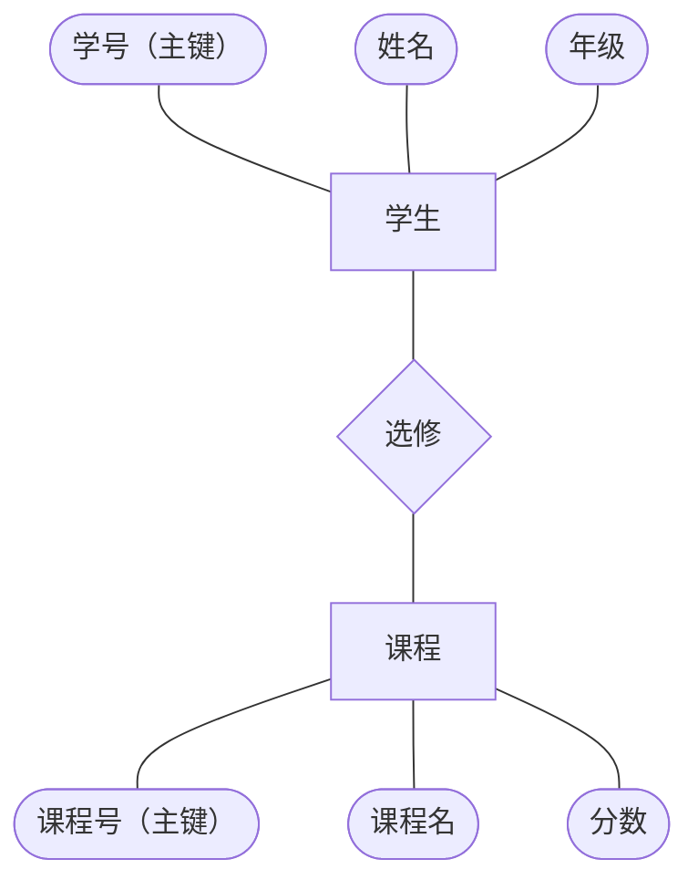

## 1. 数据库系统的基本概念

### 1.1 数据（Data）
**定义：**  
描述事物的符号记录，是数据库中存储的基本对象。

**示例：**  学生表中的：学号：2025001  姓名：张无忌  年龄：30

---

### 1.2 数据库（DB）
**定义：**  
长期存储在计算机内、有组织的、可共享的`数据集合`。

**示例：**  
学校教务管理系统中的数据库，包含：学生表、课程表、选课关系表

---

### 1.3 数据库管理系统（DBMS）
**定义：**  
管理数据库的软件系统。

**主要功能：**
1. 数据库定义功能
2. 数据存取功能
3. 数据库运行管理
4. 数据库的建立和维护功能

**示例：**  
MySQL 可以完成：
- 创建表结构（`CREATE TABLE`）
- 执行 SQL 查询（`SELECT`）

---

### 1.4 数据库系统（DBS）
**组成**：数据库 (DB) + 数据库管理系统（DBMS）+ 应用程序 + 用户（使用数据库的人）

**示例：**  
电商平台通过 Java 程序调用 Oracle DBMS，管理订单、用户等数据。

---

## 2. 数据库的发展阶段

### 2.1 人工管理阶段（1945—1955）
**特点：**
- 无直接存储设备
- 数据依赖程序
- 无共享性

**示例：** 早期科学计算中，数据随程序一起提交。

---

### 2.2 文件系统阶段（1955—1965）
**特点：**
- 磁盘存储出现
- 数据以文件形式组织
- 但冗余度高

**示例：** 企业用文本文件存储员工信息，容易产生重复数据。

---

### 2.3 数据库系统阶段（1965至今）
**特点：**
- 数据按模型组织
- 共享性高
- 独立性增强

**示例：** 关系型数据库 MySQL 支持多用户并发访问同一数据表。

---

## 3. 数据模型

### 3.1 概念模型（E-R 模型）
用于从现实世界抽象出数据对象及其联系。

#### 基本概念
- **实体（Entity）：** 客观存在的事物，如“学生”
- **属性（Attribute）：** 实体特征，如“学号”“姓名”
- **联系（Relationship）：** 实体之间的关系，如“选修课程”

#### 示例


#### E-R 图表示规则
- 实体：矩形
- 属性：椭圆形
- 联系：菱形
- 主键属性：属性名下划线标识

---

### 3.2 逻辑模型
逻辑模型是将概念模型进一步转换为数据库可实现的结构。

#### 1）层次模型
**特点：**
- 树状结构
- 适合简单层级关系（如家族谱）

**条件：**
1. 有且只有一个结点没有双亲结点，该结点称为根结点
2. 根以外的其他结点有且只有一个双亲结点

---

#### 2）网状模型
**特点：**
- 复杂网络结构
- 支持多对多关系（如交通网络）

**条件：**
1. 允许一个以上的结点无双亲
2. 一个结点可以有多于一个双亲

---

#### 3）关系模型
**特点：**
- 二维表结构
- 是后续学习的重点

**基本术语：**
- **关系：** 通常对应一张表
- **元组：** 表中的一行
- **属性：** 表中的一列
- **码：** 又称码键，用于唯一标识实体属性  
  比如: 超码-候选码-主码
- **域：** 一组具有相同数据类型的值的集合
- **分量：** 元组中的一个属性值

---

### 3.3 物理模型
**定义：**  
描述数据在磁盘上的存储方式，是最底层的抽象。

**示例：**
- B+ 树索引
- 哈希存储

---

## 4. 数据库系统结构

模式数据库中全体数据的逻辑结构和特征的描述, 仅仅设计型的描述, 不涉及具体的值

某一个具体值称为模式的一个实例

### 4.1 三级模式结构

#### 1）外模式
也叫`用户视图`或`子模式`，是应用程序员和最终用户`能够看见和使用`的局部数据的逻辑结构和特征描述。
如: 学生只能看到“课程号、成绩”。

---

#### 2）模式
也叫**逻辑模式**，是数据库中`全体数据的逻辑结构和特征`的描述。
如: 学生表, 课程表, 选课表

---

#### 3）内模式
也叫**存储模式**，一个数据库只有一个内模式，它描述数据库的物理表示。

**示例：**
- 数据采用什么存储方式（顺序存储、B+ 树存储）
- 索引如何组织
- 数据是否压缩
- 数据是否加密

---

### 4.2 二级映像

数据库系统在三级模式之间提供两级映像：

#### 1）外模式 / 模式映像
**作用：保证逻辑独立性**

**含义：**  
用户的应用程序与数据库结构相互独立。  
```
当数据的逻辑结构发生变化时，用户程序可以不修改。
原来的学生逻辑结构为：
- 学号
- 姓名
- 性别

现在增加属性：
- 出生日期

逻辑结构变为：
- 学号
- 姓名
- 性别
- 出生日期

之后由 DBA 修改外模式/模式映像，使外模式保持不变，因此应用程序不必修改，从而保证数据与程序之间的逻辑独立性。
```

---

#### 2）模式 / 内模式映像
**作用：保证物理独立性**

```
当数据库的内模式发生改变时，数据的逻辑结构不变。  
应用程序处理的是逻辑结构，因此物理存储方式变化时，应用程序通常不必修改  
更换存储设备或调整物理存储方式时，无需修改 SQL 语句。
```
---

## 5. 数据库系统的组成

### 5.1 硬件平台及数据库
需要具备：
- 足够大的内存
- 磁盘或磁盘阵列等设备
- 较高的通道能力，以提高数据传送率

---

### 5.2 软件
数据库系统的软件主要包括：

- **DBMS**  
  用于数据库的建立、使用和维护配置的系统软件

- **支持 DBMS 运行的操作系统**

- **具有与数据库接口的高级语言及编译系统**  
  便于开发应用程序

- **以 DBMS 为核心的应用开发工具**

- **为特定应用环境开发的数据库应用系统**

---

### 5.3 人员
开发、管理和使用数据库的人员
主要包括：数据库管理员（DBA）, 系统分析员, 数据库设计人员, 应用程序员, 用户

**1. 数据库管理员（DBA）**  
全面负责数据库系统的日常管理、维护和运行。

**2. 系统分析员、数据库设计人员**  
从事需求分析、信息系统项目架构设计（包括概要设计和详细设计）、开发阶段主要模块的规划、设计和测试。

**3. 应用程序员**  
负责设计和编制应用程序。通常使用 C 语言、数据库语言等来设计和编写应用程序。

**4. 用户**  
用户是管理、开发、使用数据库的主体。

---

## 6. 数据库系统类型与应用

### 6.1 类型

#### 1）关系型数据库
**示例：**
- MySQL
- Oracle
适合结构化数据。

---

#### 2）非关系型数据库
**示例：**
- MongoDB（文档型）
- Redis（键值型）
适合非结构化数据。

---

#### 3）分布式数据库
**示例：**
- Cassandra
支持海量数据与高并发访问。